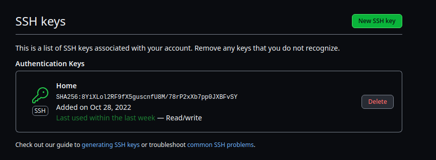
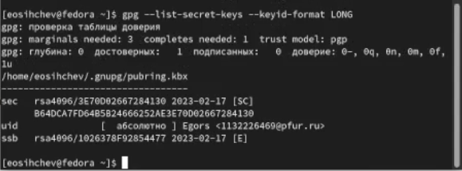
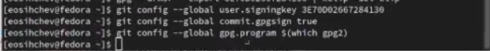
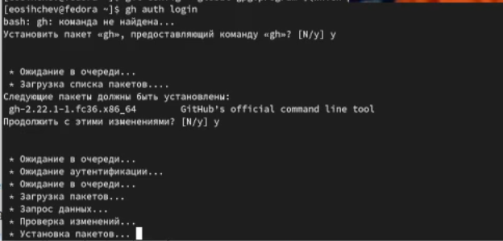
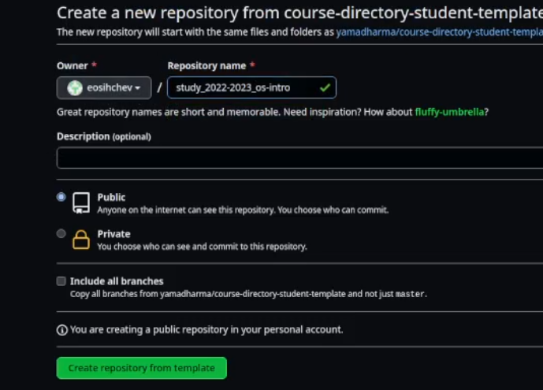
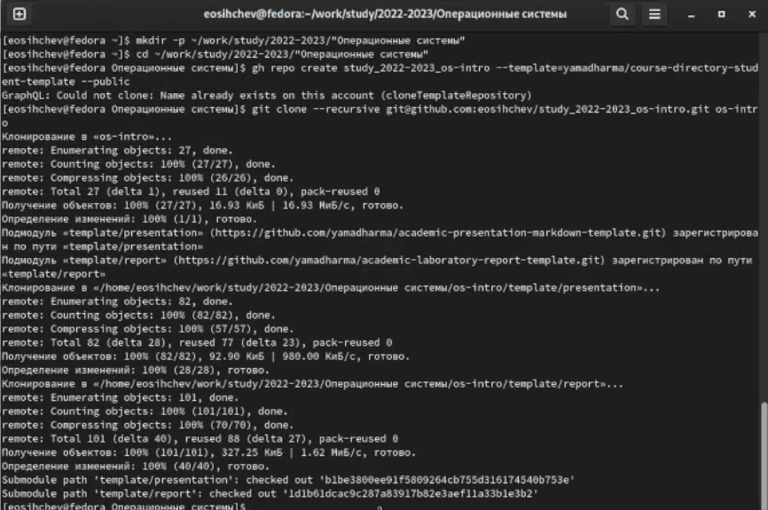
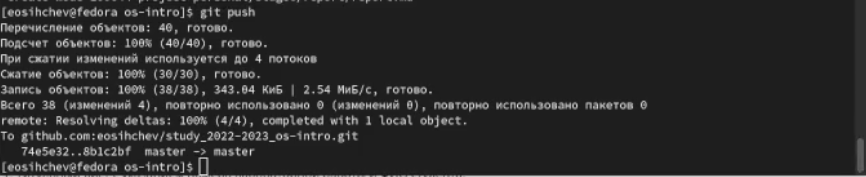
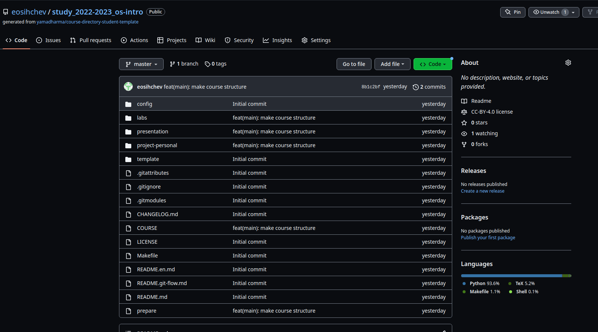

---
## Front matter
lang: ru-RU
title: "Лабораторная работа №2"
subtitle: "Дисциплина: Операционные системы"
author:
  - Сычев Е.О.
institute:
  - Российский университет дружбы народов, Москва, Россия

date: 18 февраля 2023

## i18n babel
babel-lang: russian
babel-otherlangs: english

## Formatting pdf
toc: false
toc-title: Содержание
slide_level: 2
aspectratio: 169
section-titles: true
theme: metropolis
header-includes:
 - \metroset{progressbar=frametitle,sectionpage=progressbar,numbering=fraction}
 - '\makeatletter'
 - '\beamer@ignorenonframefalse'
 - '\makeatother'
---

# Цель работы

Изучить идеологию и применение средств контроля версий. Освоить умение по работе с git.

# Выполнение лабораторной работы

## Установка git,gh. Базовая настройка git. Создание ssh ключа. (Выполнено в предыдущих лабораторных работах)

## Создание pgp ключа.

## Добавление pgp ключа в github.

## Добавление pgp ключа в github.

## Добавление pgp ключа в github.

## Настройка автоматических подписей коммитов git.

## Настройка gh.

## Настройка gh.

## Создание репозитория курса на основае шаблона и настройка каталога курса.

## Создание репозитория курса на основае шаблона и настройка каталога курса.

## Создание репозитория курса на основае шаблона и настройка каталога курса.

## Создание репозитория курса на основае шаблона и настройка каталога курса.

## Создание репозитория курса на основае шаблона и настройка каталога курса.

## Создание репозитория курса на основае шаблона и настройка каталога курса.

# Вывод

Я изучил идеологию и применение средств контроля версий. И освоил умения по работе с git.
