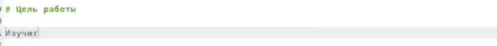
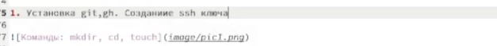
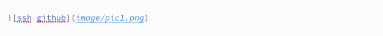
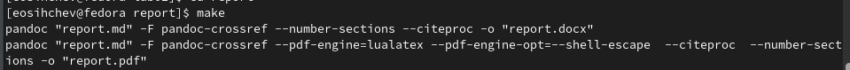
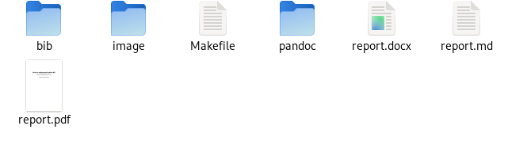
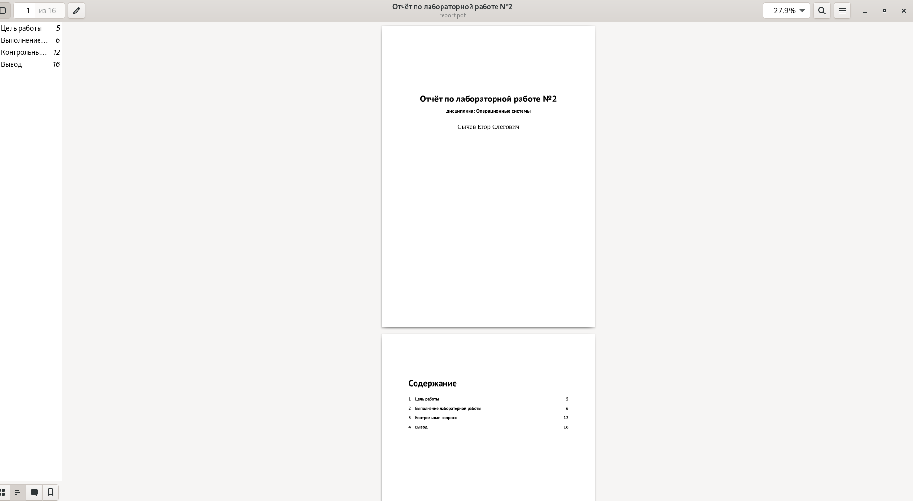
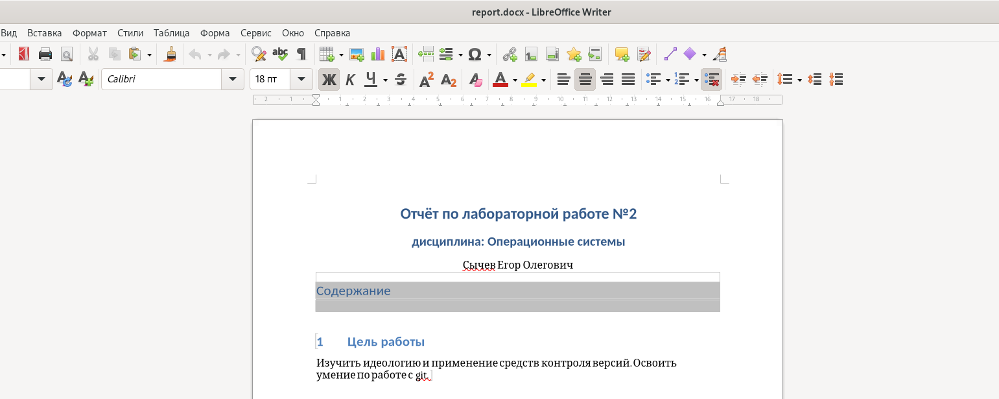

---
## Front matter
lang: ru-RU
title: "Лабораторная работа №3"
subtitle: "Дисциплина: Операционные системы"
author:
  - Сычев Е.О.
institute:
  - Российский университет дружбы народов, Москва, Россия

date: 18 февраля 2023

## i18n babel
babel-lang: russian
babel-otherlangs: english

## Formatting pdf
toc: false
toc-title: Содержание
slide_level: 2
aspectratio: 169
section-titles: true
theme: metropolis
header-includes:
 - \metroset{progressbar=frametitle,sectionpage=progressbar,numbering=fraction}
 - '\makeatletter'
 - '\beamer@ignorenonframefalse'
 - '\makeatother'
---

# Цель работы

Научиться оформлять отчёты с помощью легковесного языка разметки Markdown

# Выполнение лабораторной работы

## Создание заголовка.

## Внутри каждого блока пишем то, что нам нужно.

## Создаем нумерованный список.

## Для картинок: указываем путь и подписываем их.

## После сохраняем md файл и прописываем команду make.

## Получаем ещё 2 файла pdf и docx.

## Получаем ещё 2 файла pdf и docx.

## Получаем ещё 2 файла pdf и docx.

# Вывод

Я научился оформлять отчёты с помощью легковесного языка разметки Markdown
