---
## Front matter
lang: ru-RU
title: "Лабораторная работа №5"
subtitle: "Дисциплина: Операционные системы"
author:
  - Сычев Е.О.
institute:
  - Российский университет дружбы народов, Москва, Россия

date: 11 марта 2023

## i18n babel
babel-lang: russian
babel-otherlangs: english

## Formatting pdf
toc: false
toc-title: Содержание
slide_level: 2
aspectratio: 169
section-titles: true
theme: metropolis
header-includes:
 - \metroset{progressbar=frametitle,sectionpage=progressbar,numbering=fraction}
 - '\makeatletter'
 - '\beamer@ignorenonframefalse'
 - '\makeatother'
---

# Цель работы

Ознакомление с файловой системой Linux, её структурой, именами и содержанием каталогов. Приобретение практических навыков по применению команд для работы с файлами и каталогами, по управлению процессами (и работами), по проверке использования диска и обслуживанию файловой системы.

# Выполнение лабораторной работы

## Выполняем все примеры, приведенные в первой части описания лабораторной работы.

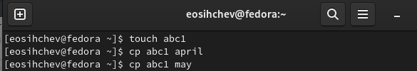

## Выполняем все примеры, приведенные в первой части описания лабораторной работы.

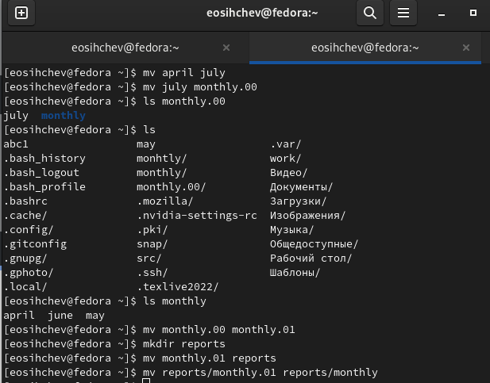

## Выполняем все примеры, приведенные в первой части описания лабораторной работы.

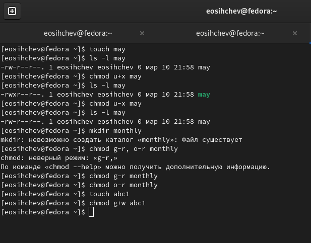

## 2.1 - 2.4

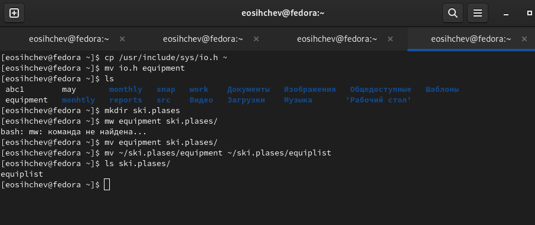

## 2.5 - 2.8

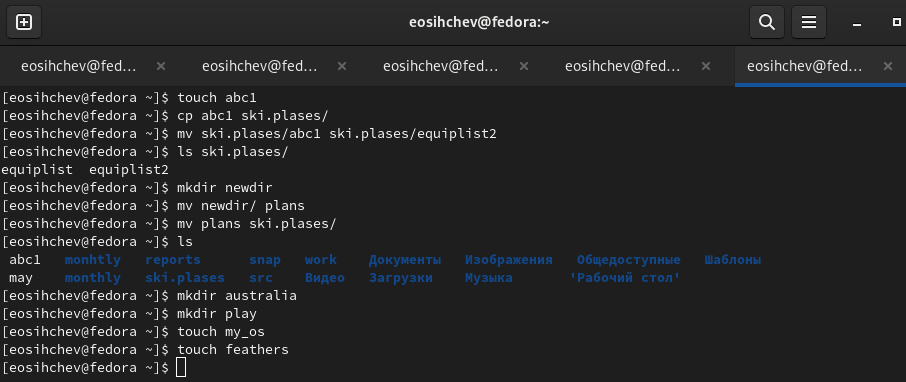

## 3.1 - 3.4

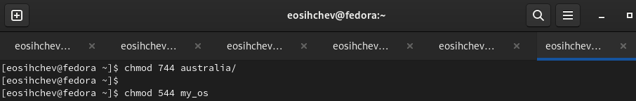

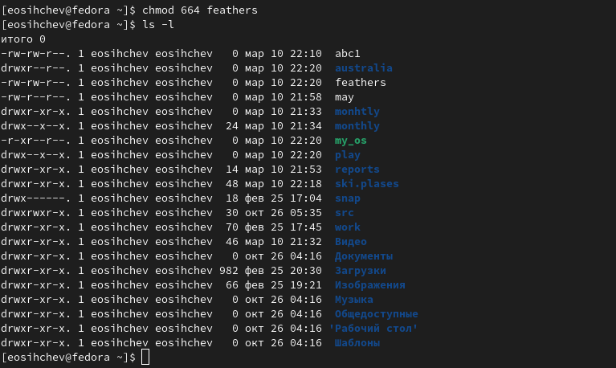

## 4.1
    
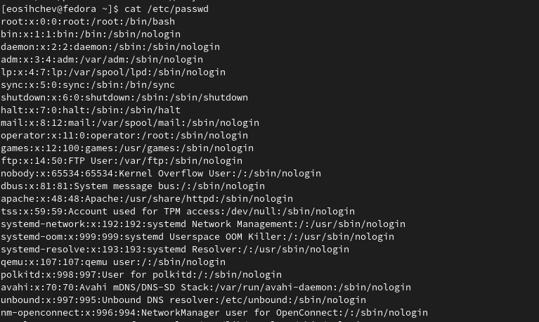
    
## 4.2 - 4.4

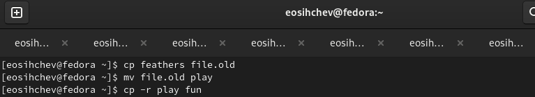

## 4.5 - 4.12

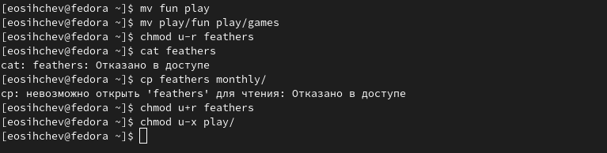

## mount

mount предназначена для монтирования файловой системы. Все файлы, доступные в Unix системах, составляют иерархическую файловую структуру, которая имеет ветки (каталоги) и листья (файлы в каталогах).
Корень этого дерева обозначается как /. Физически файлы могут располагаться на различных устройствах. Команда mount служит для подключения файловых систем разных устройств к этому большому дереву. 

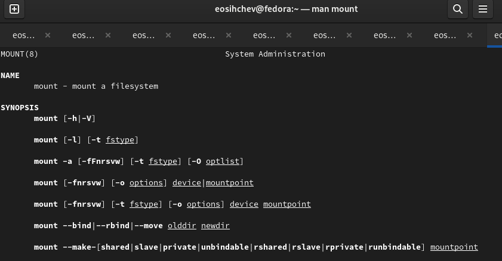

## fsck

fsck это утилита командной строки, которая позволяет выполнять проверки
согласованности и интерактивное исправление в одной или нескольких файловых системах Linux. Он использует программы, специфичные для типа файловой системы, которую он проверяет. У команды fsck следующий синтаксис: fsck параметр – параметры ФС ... Например, если нужно восстановить («починить») файловую систему на некотором устройстве /dev/sdb2, следует воспользоваться командой: «sudo fsck -y /dev/sdb2»

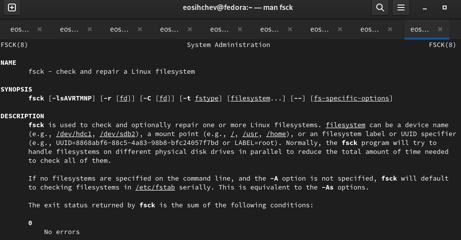

## mkfs

mkfs создаёт новую файловую систему Linux. Имеет следующий синтаксис: mkfs  -V   -t fstype  fs-options  filesys  blocks  mkfs используется для создания файловой системы Linux на некотором устройстве, обычно в разделе жёсткого диска. В качестве аргумента filesys для файловой системы может выступать или название устройства (например, /dev/hda1, /dev/sdb2) или точка монтирования (например, /, /usr, /home).

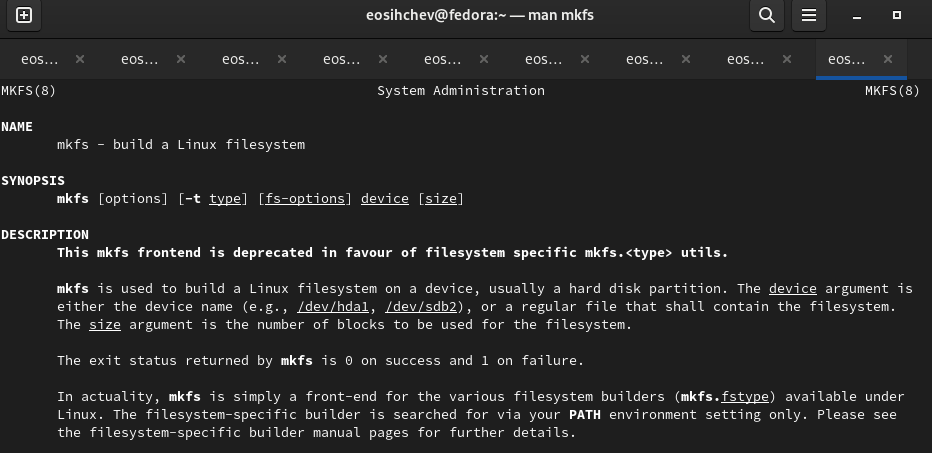

## kill

kill посылает сигнал процессу или выводит список допустимых сигналов. 
Имеет следующий синтаксис: kill [опции] PID, где PID – это PID (числовой идентификатор) процесса или несколько PID процессов, если требуется послать сигнал сразу нескольким процессам. Например, команда «kill -KILL 3121» посылает сигнал KILL процессу с PID 3121, чтобы принудительно завершить процесс

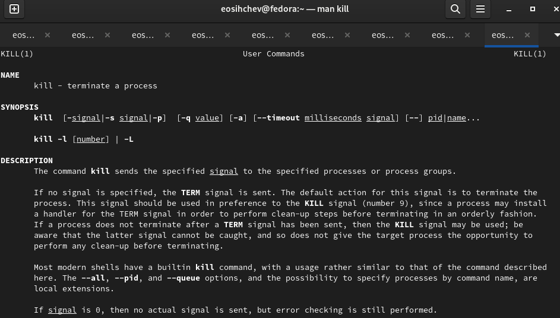

# Вывод

Я ознакомился с файловой системой Linux, её структурой, именами и содержанием каталогов и приобрел практические навыки по применению команд для работы с файлами и каталогами, по управлению процессами (и работами), по проверке использования диска и обслуживанию файловой системы.
