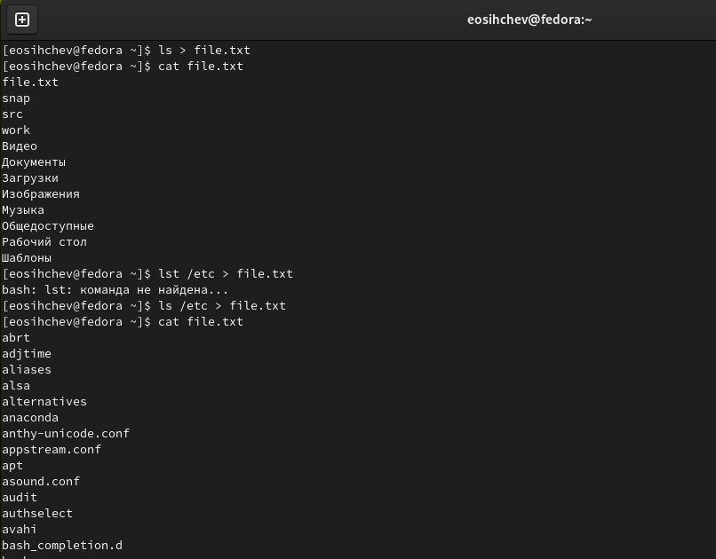
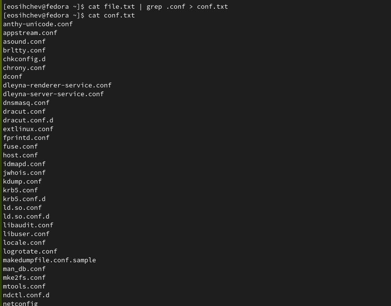
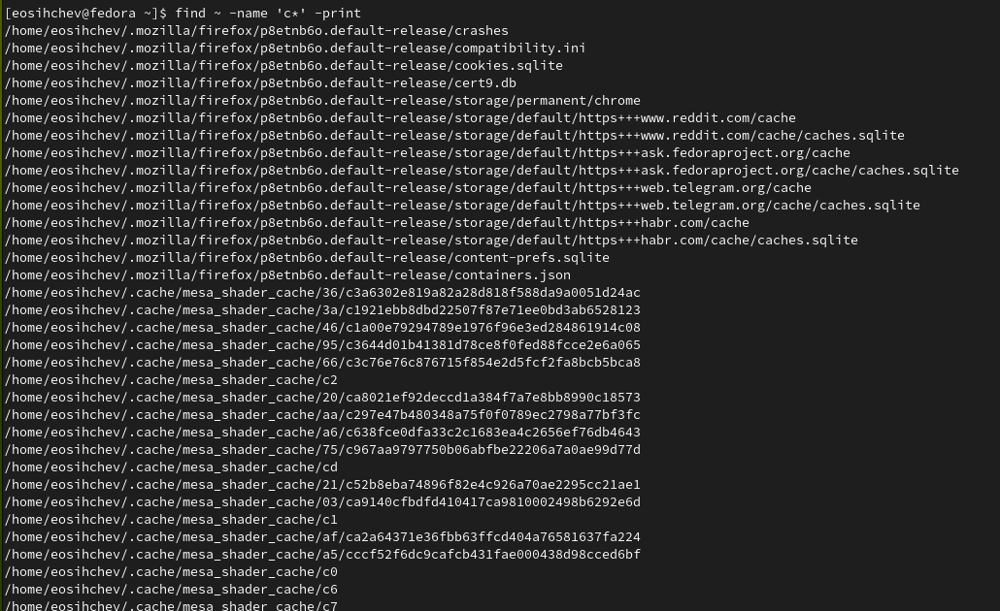
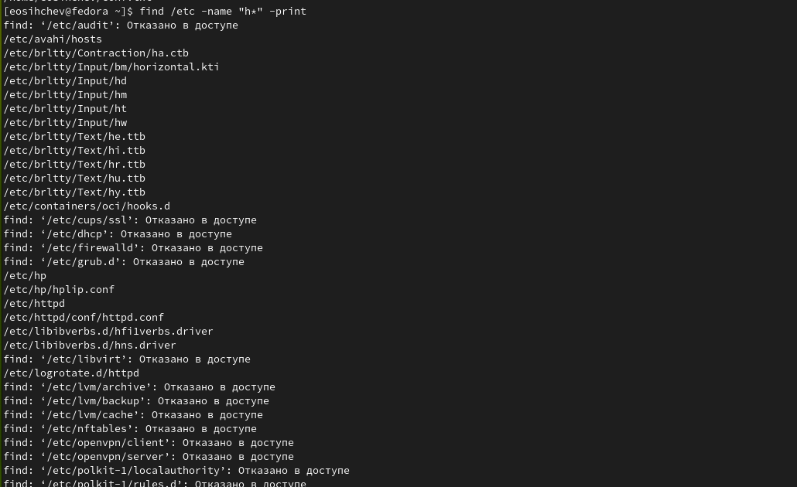
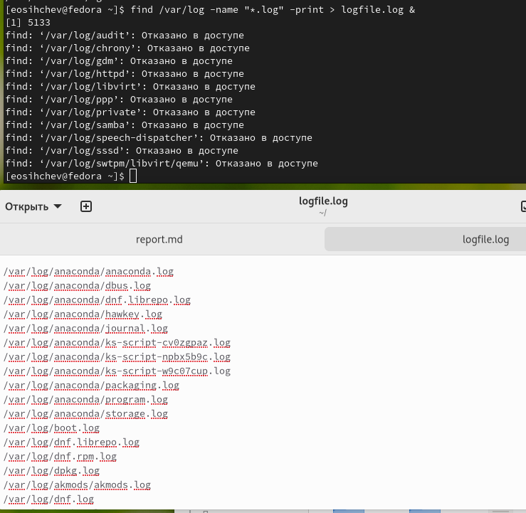
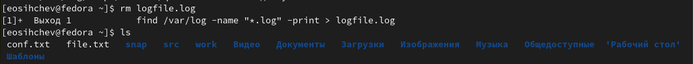
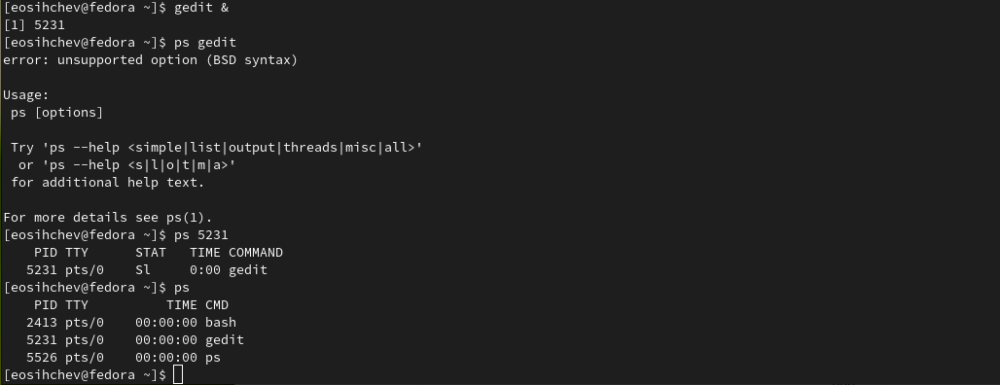
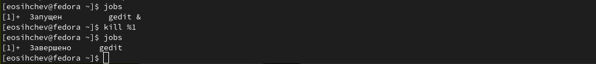
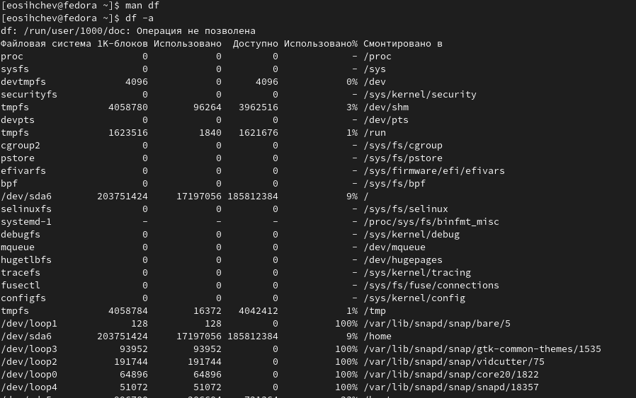
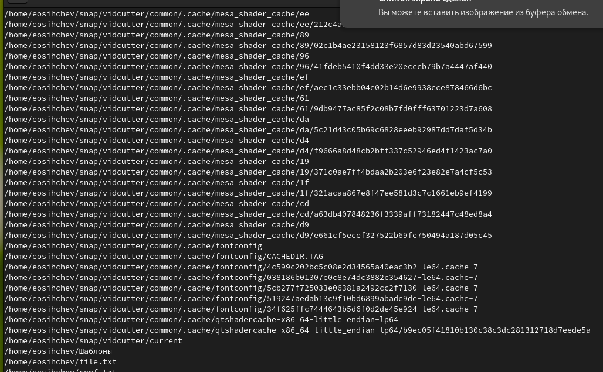

---
## Front matter
lang: ru-RU
title: "Лабораторная работа №6"
subtitle: "Дисциплина: Операционные системы"
author:
  - Сычев Е.О.
institute:
  - Российский университет дружбы народов, Москва, Россия

date: 18 марта 2023

## i18n babel
babel-lang: russian
babel-otherlangs: english

## Formatting pdf
toc: false
toc-title: Содержание
slide_level: 2
aspectratio: 169
section-titles: true
theme: metropolis
header-includes:
 - \metroset{progressbar=frametitle,sectionpage=progressbar,numbering=fraction}
 - '\makeatletter'
 - '\beamer@ignorenonframefalse'
 - '\makeatother'
---

# Цель работы

Ознакомление с инструментами поиска файлов и фильтрации текстовых данных. Приобретение практических навыков: по управлению процессами (и заданиями), по проверке использования диска и обслуживанию файловых систем.

# Выполнение лабораторной работы

## Запишем в файл file.txt названия файлов, содержащихся в каталоге /etc. Допишем в этот же файл названия файлов, содержащихся в домашнем каталоге.

## Выведем имена всех файлов из file.txt, имеющих расширение .conf, после чего запишем их в новый текстовый файл conf.txt.

## Определим, какие файлы в домашнем каталоге имеют имена, начинавшиеся с символа c, с помощью команды find.

## Выведем на экран имена файлов из каталога /etc, начинающихся с символа h.

## Запустим в фоновом режиме процесс, который будет записывать в файл ~/logfile файлы, имена которых начинаются с log.

## Удалим файл ~/logfile.

## Запустим из консоли в фоновом режиме редактор gedit и определим идентификатор процесса gedit.
    

    
## Используем команду kill для завершения процесса gedit.

## Выполним команды df и du.

## Воспользовавшись справкой команды find, выведем имена всех директорий, имеющихся в домашнем каталоге.

## Воспользовавшись справкой команды find, выведем имена всех директорий, имеющихся в домашнем каталоге.

# Вывод

Я научился взаимодействовать с файлами: записывать в них данные, искать нужную строку по названию
