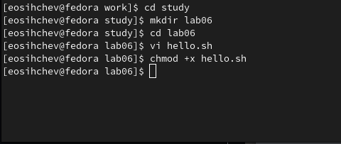
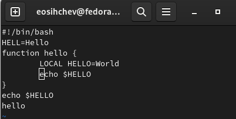
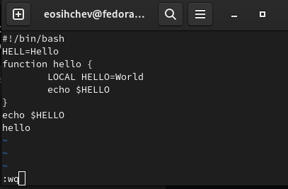
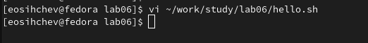
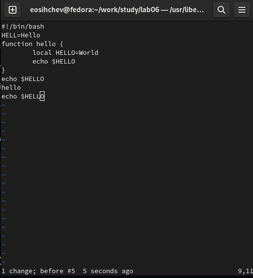
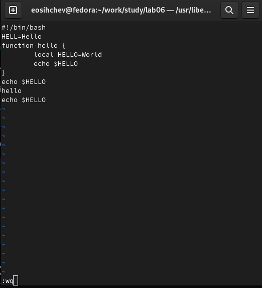

---
## Front matter
lang: ru-RU
title: "Лабораторная работа №8"
subtitle: "Дисциплина: Операционные системы"
author:
  - Сычев Е.О.
institute:
  - Российский университет дружбы народов, Москва, Россия

date: 1 апреля 2023

## i18n babel
babel-lang: russian
babel-otherlangs: english

## Formatting pdf
toc: false
toc-title: Содержание
slide_level: 2
aspectratio: 169
section-titles: true
theme: metropolis
header-includes:
 - \metroset{progressbar=frametitle,sectionpage=progressbar,numbering=fraction}
 - '\makeatletter'
 - '\beamer@ignorenonframefalse'
 - '\makeatother'
---

# Цель работы

Познакомиться с операционной системой Linux. Получить практические навыки работы с редактором vi, установленным по умолчанию практически во всех дистрибутивах.

# Выполнение лабораторной работы

## Создаем каталог с именем lab06, переходим в него и создаем файл hello.sh.

## Нажмем клавишу i и вводим следующий текст.

## Нажмем :. Запишем изменения и завершим работу над файлом. Делаем файл исполняемым: chmod +x hello.sh

## Вызываем vi на редактирование файла.

## Изменяем HELL на HELLO, LOCAL на local и добавляем последнюю строчку.

## Записываем изменения и завершаем работу на файлом.

# Вывод

Я познакомился с операционной системой Linux. Получил практические навыки работы с редактором vi, установленным по умолчанию практически во всех дистрибутивах.
