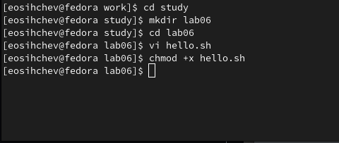
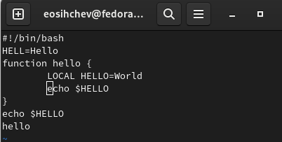
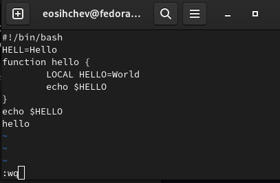
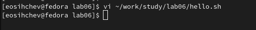
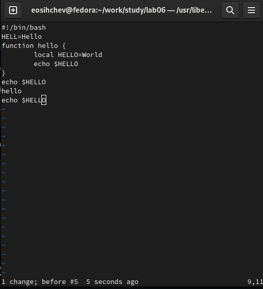
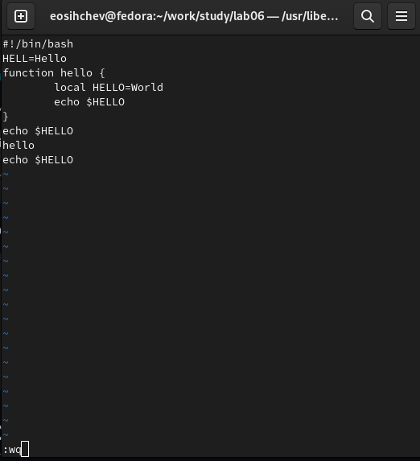

---
## Front matter
title: "Отчёт по лабораторной работе №8"
subtitle: "дисциплина: Операционные системы"
author: "Сычев Егор Олегович"

## Generic otions
lang: ru-RU
toc-title: "Содержание"

## Bibliography
bibliography: bib/cite.bib
csl: pandoc/csl/gost-r-7-0-5-2008-numeric.csl

## Pdf output format
toc: true # Table of contents
toc-depth: 2
lof: true # List of figures
lot: true # List of tables
fontsize: 12pt
linestretch: 1.5
papersize: a4
documentclass: scrreprt
## I18n polyglossia
polyglossia-lang:
  name: russian
  options:
	- spelling=modern
	- babelshorthands=true
polyglossia-otherlangs:
  name: english
## I18n babel
babel-lang: russian
babel-otherlangs: english
## Fonts
mainfont: PT Serif
romanfont: PT Serif
sansfont: PT Sans
monofont: PT Mono
mainfontoptions: Ligatures=TeX
romanfontoptions: Ligatures=TeX
sansfontoptions: Ligatures=TeX,Scale=MatchLowercase
monofontoptions: Scale=MatchLowercase,Scale=0.9
## Biblatex
biblatex: true
biblio-style: "gost-numeric"
biblatexoptions:
  - parentracker=true
  - backend=biber
  - hyperref=auto
  - language=auto
  - autolang=other*
  - citestyle=gost-numeric
## Pandoc-crossref LaTeX customization5
figureTitle: "Рис."
tableTitle: "Таблица"
listingTitle: "Листинг"
lofTitle: "Список иллюстраций"
lotTitle: "Список таблиц"
lolTitle: "Листинги"
## Misc options
indent: true
header-includes:
  - \usepackage{indentfirst}
  - \usepackage{float} # keep figures where there are in the text
  - \floatplacement{figure}{H} # keep figures where there are in the text
---

# Цель работы

Познакомиться с операционной системой Linux. Получить практические навыки работы с редактором vi, установленным по умолчанию практически во всех дистрибутивах.

# Выполнение лабораторной работы

1. Создаем каталог с именем lab06, переходим в него и создаем файл hello.sh.

2. Нажмем клавишу i и вводим следующий текст.

3. Нажмем :. Запишем изменения и завершим работу над файлом. Делаем файл исполняемым: chmod +x hello.sh

4. Вызываем vi на редактирование файла.

5. Изменяем HELL на HELLO, LOCAL на local и добавляем последнюю строчку.

6. Записываем изменения и завершаем работу на файлом.

# Вывод

Я познакомился с операционной системой Linux. Получил практические навыки работы с редактором vi, установленным по умолчанию практически во всех дистрибутивах.

# Контрольные вопросы

1. Дайте краткую характеристику режимам работы редактора vi.

Редактор vi имеет три режима работы: – командный режим — предназначен для ввода команд редактирования и навигации по редактируемому файлу; – режим вставки — предназначен для ввода содержания редактируемого файла; – режим последней (или командной) строки — используется для записи изменений в файл и выхода из редактора.

2. Как выйти из редактора, не сохраняя произведённые изменения?

Набрать символ q (или q!), если требуется выйти из редактора без сохранения.

3. Назовите и дайте краткую характеристику командам позиционирования.

0 (ноль) — переход в начало строки;

$ — переход в конец строки;

G — переход в конец файла;

nG — переход на строку с номером 𝑛.

4. Что для редактора vi является словом?

При использовании прописных W и B под разделителями понимаются только пробел, табуляция и возврат каретки. При использовании строчных w и b под разделителями понимаются также любые знаки пунктуации.

5. Каким образом из любого места редактируемого файла перейти в начало (конец) файла?

Для того, чтобы переместить курсор в начало файла, можно использовать команду 1G. Для перехода в конец файла необходимо нажать G.

6. Назовите и дайте краткую характеристику основным группам команд редактирования.

Команды редактирования: вставка текста, вставка строки, удаление текста, отмена и повтор произведённых изменений, копирование текста в буфер, вставка текста из буфера, замена текста, поиск текста.

7. Необходимо заполнить строку символами $. Каковы ваши действия?

Перейду в режим вставки и введу необходимое количество $.

8. Как отменить некорректное действие, связанное с процессом редактирования?

Отменить последнее действие с помощью команды u.

9. Hазовите и дайте характеристику основным группам команд режима последней строки.

Команды редактирования в режиме командной строки: копирование и перемещение текста, запись в файл и выход из редактора.

10. Как определить, не перемещая курсора, позицию, в которой заканчивается строка?

Необходимо перейти в конец строки с помощью $.

11. Выполните анализ опций редактора vi (сколько их, как узнать их назначение и т.д.).

Опции редактора vi позволяют настроить рабочую среду. Для задания опций используется команда set (в режиме последней строки):
• : set all — вывести полный список опций;

• : set nu — вывести номера строк;

• : set list — вывести невидимые символы;

• : set ic — не учитывать при поиске, является ли символ прописным или строчным. Если вы хотите отказаться от использования опции, то в команде set перед именем опции надо поставить no.

12. Как определить режим работы редактора vi?

Eсли в нижнем углу выводиться Insert - мы находимся в режиме вставки. Если курсор находится в конце файла и можно увидеть там двоеточие - режим последней (или командной) строки В ином случаи - мы находимся в командном режиме.

13. Постройте граф взаимосвязи режимов работы редактора vi.

- командный режим
- режим вставки
- режим последней строки

