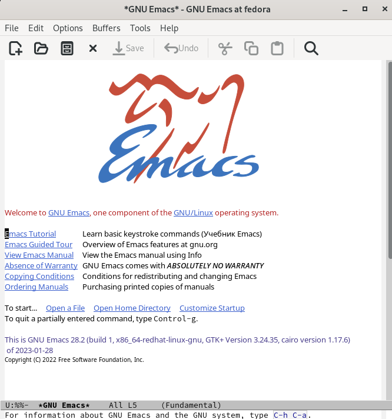
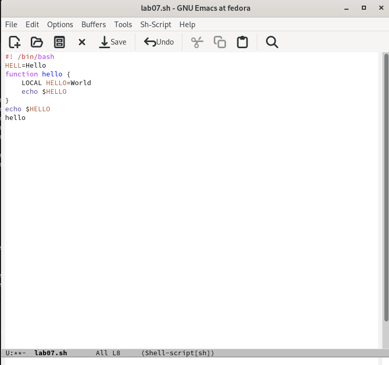
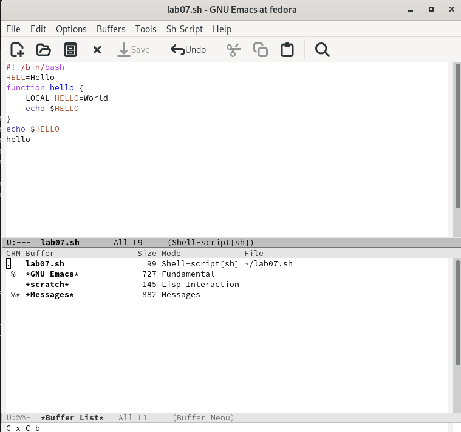
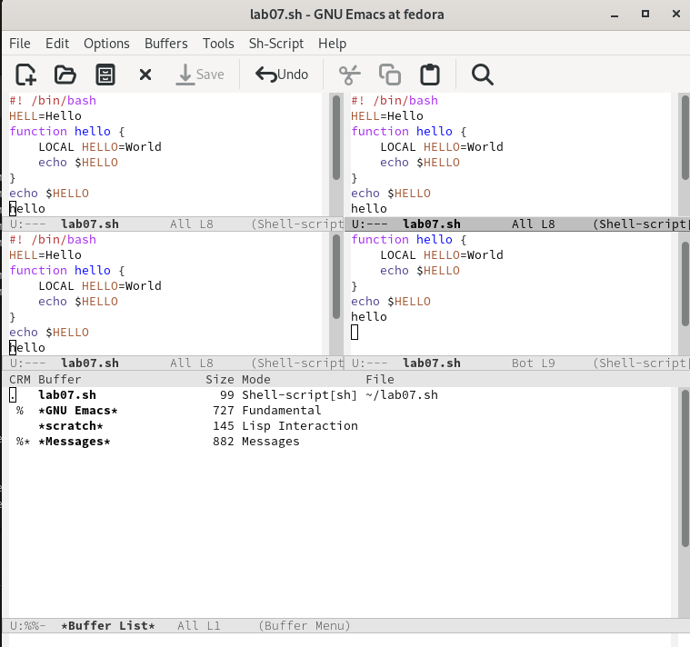
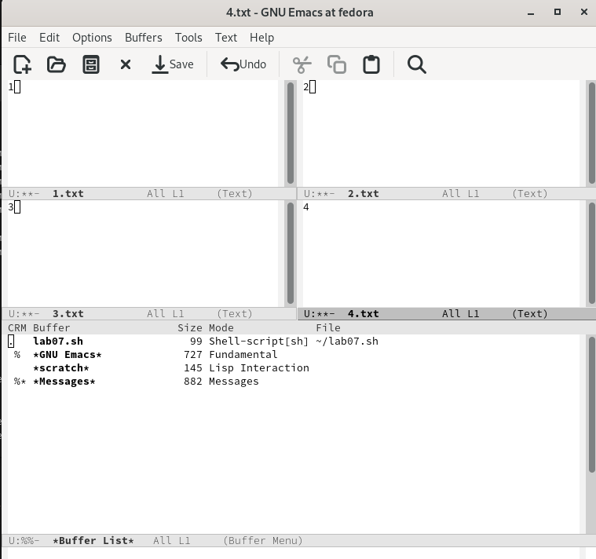
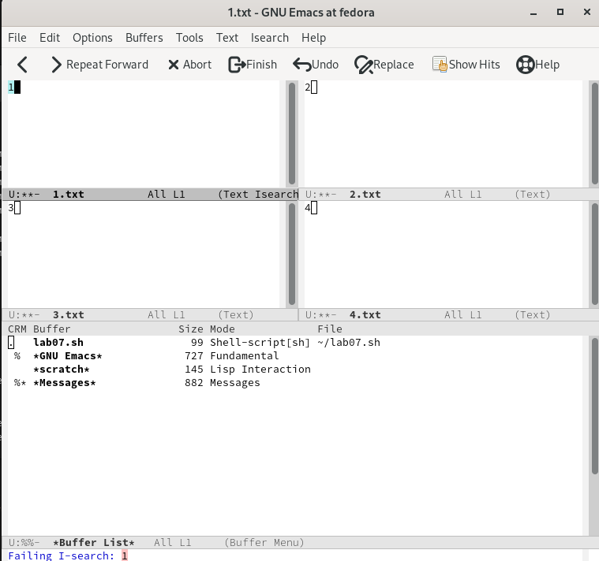
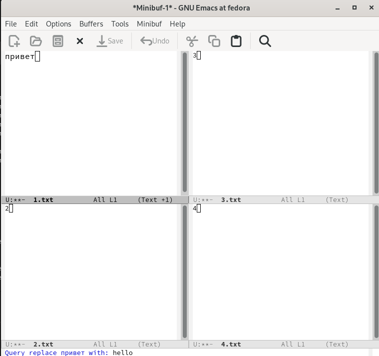

---
## Front matter
lang: ru-RU
title: "Лабораторная работа №9"
subtitle: "Дисциплина: Операционные системы"
author:
  - Сычев Е.О.
institute:
  - Российский университет дружбы народов, Москва, Россия

date: 8 апреля 2023

## i18n babel
babel-lang: russian
babel-otherlangs: english

## Formatting pdf
toc: false
toc-title: Содержание
slide_level: 2
aspectratio: 169
section-titles: true
theme: metropolis
header-includes:
 - \metroset{progressbar=frametitle,sectionpage=progressbar,numbering=fraction}
 - '\makeatletter'
 - '\beamer@ignorenonframefalse'
 - '\makeatother'
---

# Цель работы

Познакомиться с операционной системой Linux. Получить практические навыки работы с редактором Emacs.

# Выполнение лабораторной работы

## Открываем emacs.

## Создаем файл lab07.sh и набираем текст. Сохраняем файл и проделываем с текстом стандартные процедуры редактирования.

## Выводим список активных буферов на экран.

## Поделим фрейм на 4 части.

## В каждом из окон создадим новый файл и введем какой-нибудь текст.

## Переключаемся в режим поиска (C-s) и найдем несколько слов.

## Переключаемся в режим поиска и замены (M-%) и заменяем несколько слов.

# Вывод

Я познакомился с операционной системой Linux, получил практические навыки работы с редактором Emacs.

