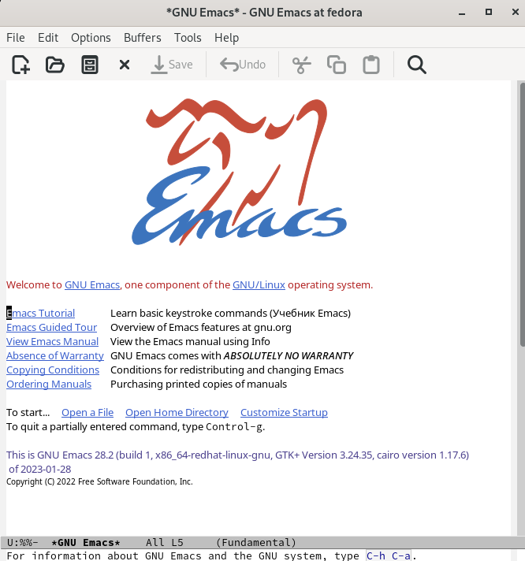
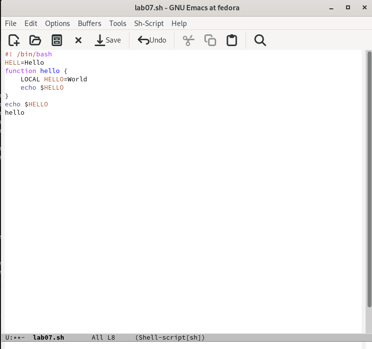
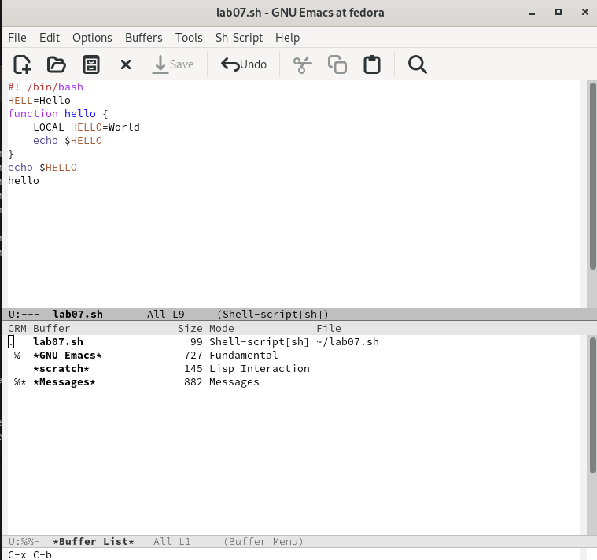
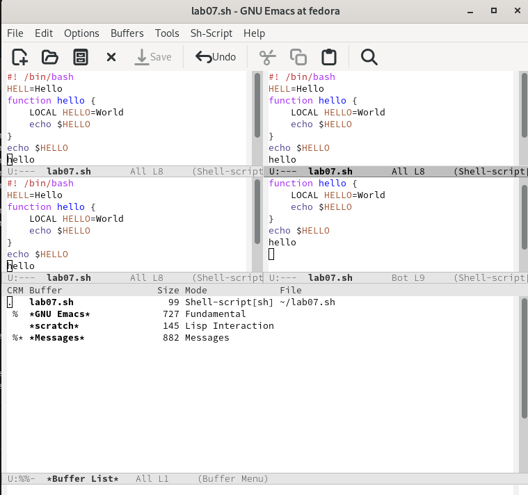
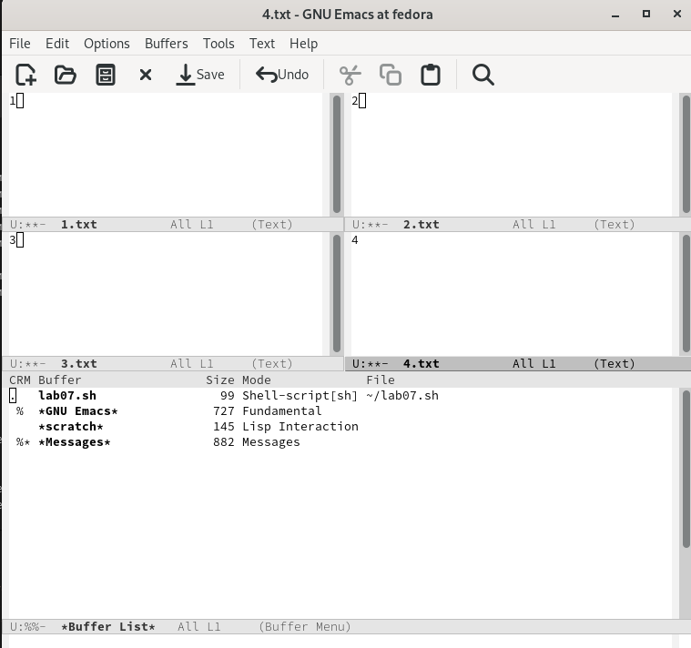
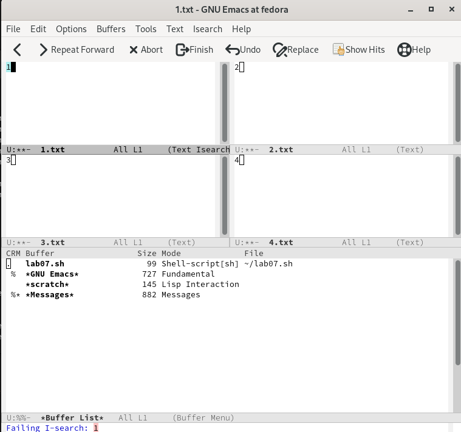
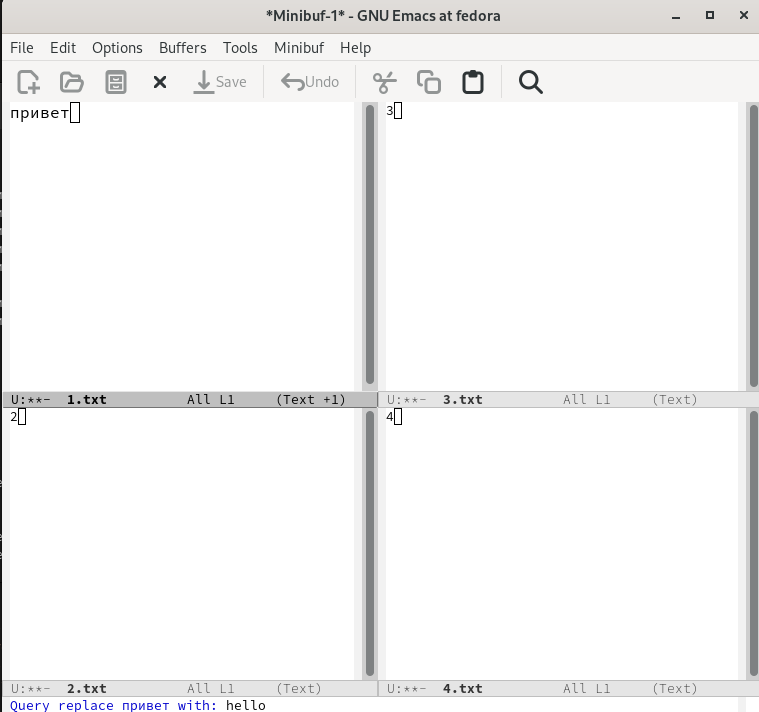

---
## Front matter
title: "Отчёт по лабораторной работе №9"
subtitle: "дисциплина: Операционные системы"
author: "Сычев Егор Олегович"

## Generic otions
lang: ru-RU
toc-title: "Содержание"

## Bibliography
bibliography: bib/cite.bib
csl: pandoc/csl/gost-r-7-0-5-2008-numeric.csl

## Pdf output format
toc: true # Table of contents
toc-depth: 2
lof: true # List of figures
lot: true # List of tables
fontsize: 12pt
linestretch: 1.5
papersize: a4
documentclass: scrreprt
## I18n polyglossia
polyglossia-lang:
  name: russian
  options:
	- spelling=modern
	- babelshorthands=true
polyglossia-otherlangs:
  name: english
## I18n babel
babel-lang: russian
babel-otherlangs: english
## Fonts
mainfont: PT Serif
romanfont: PT Serif
sansfont: PT Sans
monofont: PT Mono
mainfontoptions: Ligatures=TeX
romanfontoptions: Ligatures=TeX
sansfontoptions: Ligatures=TeX,Scale=MatchLowercase
monofontoptions: Scale=MatchLowercase,Scale=0.9
## Biblatex
biblatex: true
biblio-style: "gost-numeric"
biblatexoptions:
  - parentracker=true
  - backend=biber
  - hyperref=auto
  - language=auto
  - autolang=other*
  - citestyle=gost-numeric
## Pandoc-crossref LaTeX customization5
figureTitle: "Рис."
tableTitle: "Таблица"
listingTitle: "Листинг"
lofTitle: "Список иллюстраций"
lotTitle: "Список таблиц"
lolTitle: "Листинги"
## Misc options
indent: true
header-includes:
  - \usepackage{indentfirst}
  - \usepackage{float} # keep figures where there are in the text
  - \floatplacement{figure}{H} # keep figures where there are in the text
---

# Цель работы

Познакомиться с операционной системой Linux. Получить практические навыки работы с редактором Emacs.

# Выполнение лабораторной работы

1. Открываем emacs.

2. Создаем файл lab07.sh и набираем текст. Сохраняем файл и проделываем с текстом стандартные процедуры редактирования.

3. Выводим список активных буферов на экран.

4. Поделим фрейм на 4 части.

5. В каждом из окон создадим новый файл и введем какой-нибудь текст.

6. Переключаемся в режим поиска (C-s) и найдем несколько слов.

7. Переключаемся в режим поиска и замены (M-%) и заменяем несколько слов.

# Вывод

Я познакомился с операционной системой Linux, получил практические навыки работы с редактором Emacs.

# Контрольные вопросы

1. Кратко охарактеризуйте редактор emacs.

Emacs представляет собой мощный экранный редактор текста, написанный на языке высокого уровня Elisp

2. Какие особенности данного редактора могут сделать его сложным для освоения новичком?

Многие рутинные операции в Emacs удобнее производить с помощью клавиатуры, а не графического меню. Наиболее часто в командах Emacs используются сочетания c клавишами Ctrl и Meta (в обозначениях Emacs: C- и M-; клавиша Shift в Emasc обозначается как S-). Так как на клавиатуре для IBM PC совместимых ПК клавиши Meta нет, то вместо неё можно использовать Alt или Esc

3. Своими словами опишите, что такое буфер и окно в терминологии emacs’а.

Буфер - это файл, содержащий какой-либо текст. Окно же можно сказать область, где вы водится текст определенного буфера

4. Можно ли открыть больше 10 буферов в одном окне?

Можно открыть больше 10 буферов в одном окне

5. Какие буферы создаются по умолчанию при запуске emacs?

Только что запущенный Emacs несет один буфер с именем `scratch’, который может быть использован для вычисления выражений Лиспа в Emacs.

6. Какие клавиши вы нажмёте, чтобы ввести следующую комбинацию C-c | и C-c C-|?

Ctrl-c |(первые две нажму вместе, а третью отдельно), Ctrl-c Ctrl-|(каждую пару нажму раздельно).

7. Как поделить текущее окно на две части?

Разделить фрейм на два окна по вертикали (C-x 3),а по горизонтали (C-x 2)

8. В каком файле хранятся настройки редактора emacs?

В файле Emacs хранятся настройки редактора.

9. Какую функцию выполняет клавиша и можно ли её переназначить?

Кнопка BACKSPACE = функции C-k и ее можно переназначить.

10. Какой редактор вам показался удобнее в работе vi или emacs?

Поясните почему Редактор Emacs мне показался удобнее, так как в нем больше возможностей по сравнению с vi.

