---
## Front matter
lang: ru-RU
title: "Индивидуальный проект. Этап №1"
subtitle: "Дисциплина: Операционные системы"
author:
  - Сычев Е.О.
institute:
  - Российский университет дружбы народов, Москва, Россия

date: 25 февраля 2023

## i18n babel
babel-lang: russian
babel-otherlangs: english

## Formatting pdf
toc: false
toc-title: Содержание
slide_level: 2
aspectratio: 169
section-titles: true
theme: metropolis
header-includes:
 - \metroset{progressbar=frametitle,sectionpage=progressbar,numbering=fraction}
 - '\makeatletter'
 - '\beamer@ignorenonframefalse'
 - '\makeatother'
---

# Цель работы

Разместить на Github pages заготовку для персонального сайта.

# Выполнение первого этапа индивидуального проекта.

## Установка необходимого программного обеспечения.

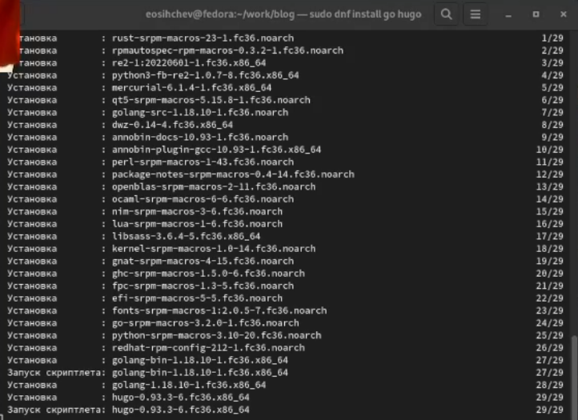

## Создание репозитория на основае шаблона и настройка каталога.

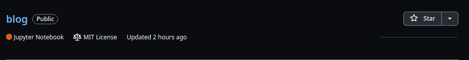

## Создание репозитория на основае шаблона и настройка каталога.

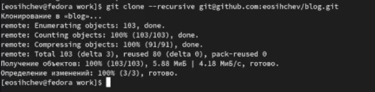

## Команда hugo server и открытие сайта.

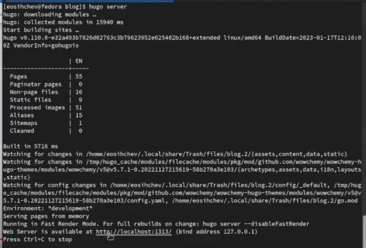

## Команда hugo server и открытие сайта.

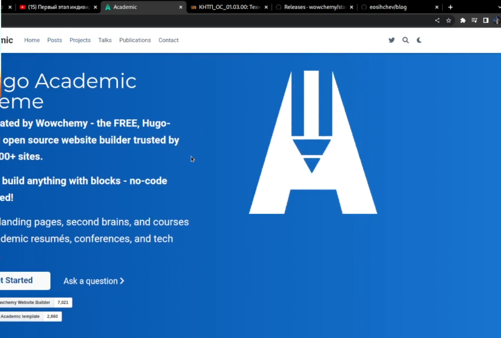

## Удаление первого блока на сайте.

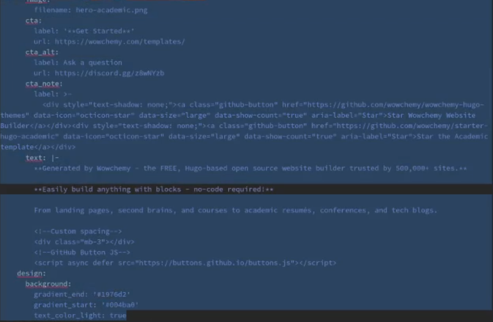

## Создание нового репозитория для развертывания на базе страниц github.

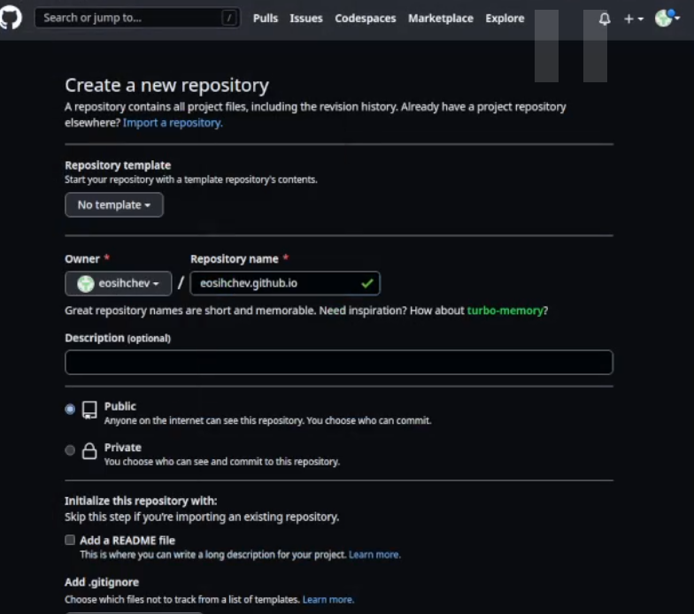

## Клонирование и настройка каталога.

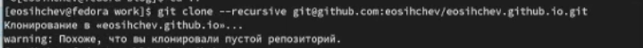

## Клонирование и настройка каталога.

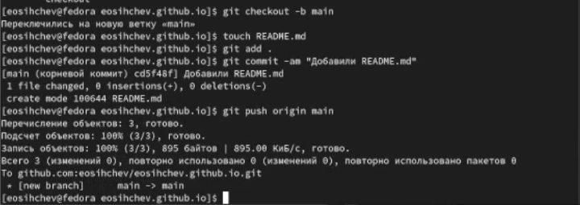

## Закомментирование public. 

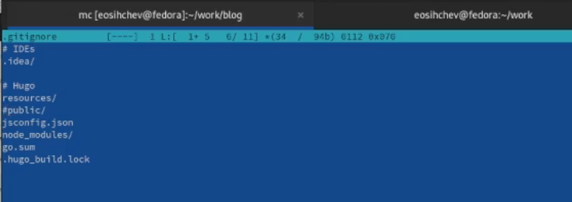

## Добавление существующего репозитория в индекс.

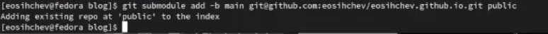

## Команды для развертывания сайта.

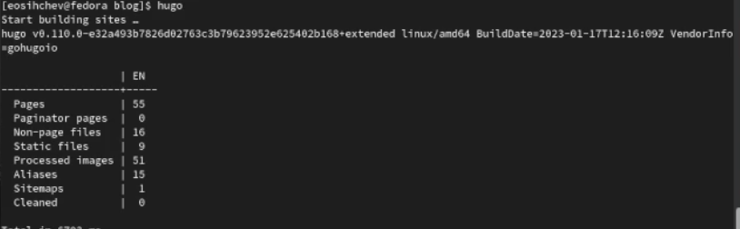

## Команды для развертывания сайта.

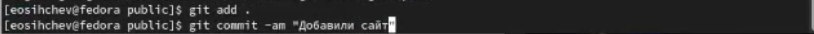

## Команды для развертывания сайта.

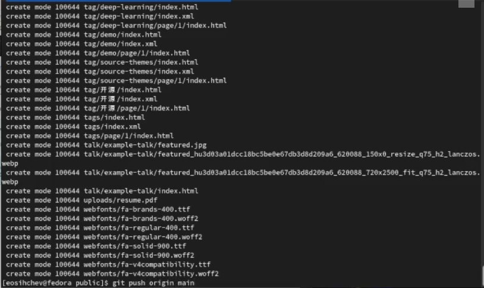

## Команды для развертывания сайта.

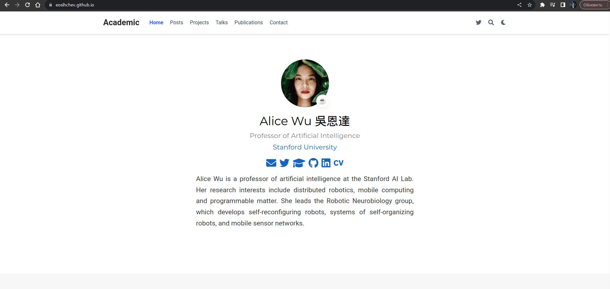

# Вывод

Я разместил на Github pages заготовку для персонального сайта.
